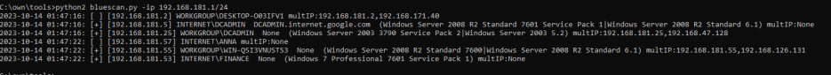
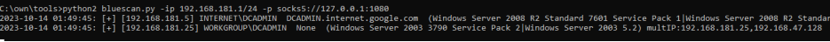

# 简介
由于经常需要收集内网主机信息，用到的工具诸如nbtscan、oxidscan等，还需要扫描MS17-010，工具太多用起来繁琐，集成化工具如fscan等又功能过多、熵值太大存在免杀问题，并且收集的信息格式整理起来比较麻烦，有些工具只能获取netbios计算机名，得不到DNS名，而有些工具如impacket的利用又在某些功能上需要这些不同的信息，为此撰写了此工具，具备如下功能：

- 接收IP/CIRD/文件格式的输入，可批量扫描输入的IP，可设置线程、超时
- 获取IP对应的netbios计算机名、dns域名、操作系统版本
- 准确识别是否存在MS17-010漏洞
- 识别是否是多网卡机器并输出其包含的IP地址
- 支持socks5代理/http代理，可通过代理远程扫描目标内网，或是打包为exe放置到目标机器使用

输出的格式如下：
```
      时间          +表示存在MS17010           netbios计算机名  dns域名                                 操作系统版本                            是否存在多IP
2023-10-14 01:47:16: [+] [192.168.181.25]  WORKGROUP\DCADMIN  None      (Windows Server 2003 3790 Service Pack 2|Windows Server 2003 5.2)  multIP:192.168.181.25,192.168.47.128
```
# 帮助
程序使用python2编写，请用python2运行。
```
C:\own\tools>python2 bluescan.py -h
usage: bluescan.py [-h] [-ip [IP]] [-f [F]] [-t [T]] [-n [N]] [-p [P]] [-nb]

optional arguments:
  -h, --help  show this help message and exit
  -ip [IP]    ip or cidr
  -f [F]      ip file
  -t [T]      timeout
  -n [N]      thread number
  -p [P]      proxy. http://x.x.x.x:xx or socks5://x.x.x.x:xx
  -nb, --nb   start nb （默认优先扫描445，若启用该选项，在445扫描失败时会进行netbios扫描）
```
运行后，会输出到屏幕和本地文件cache.dat用作保存。
# 例子
扫描一个c段：



使用代理进行扫描：


